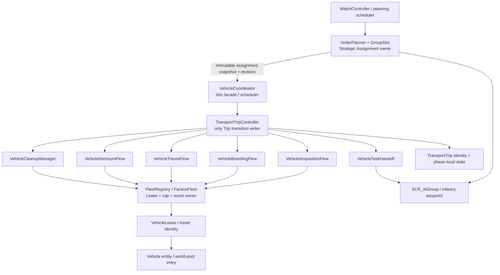

# Stage 3 / 3.5 vehicle-domain rewrite

Статус этапов: **FAILED — REWRITE IMPLEMENTATION/CUTOVER COMPLETE, RUNTIME ACCEPTANCE NOT PASSED**.

Этот документ фиксирует реализованную архитектуру новой реализации. Он не меняет результаты приёмки: исторические Stage 3 Transport T1–T9 и Armed A1 остаются `FAIL`; оба фактических Stage 3.5 Transport-прогона остаются `FAIL`; preliminary repeat smoke остаётся `BLOCKED`; B/P/A/R/L/M30/S120, Repeat T и Repeat‑T2 остаются `NOT RUN`. Final-tree development smoke также `BLOCKED` внешним backend и не относится к этим срезам. Static/Workbench evidence остаётся development evidence и не является runtime `PASS`.

## Фактический итог implementation/cutover

- Strategic Assignment, Transport Trip и Vehicle Lease/Faction Fleet реализованы как независимые lifecycle/ownership domains.
- Coordinator переключён на thin facade/composition root/scheduler; legacy runtime и coordinator phase/side-effect fragments удалены.
- Acquisition, boarding, transit, dismount, task handoff и cleanup имеют отдельных владельцев; старый и новый side-effect path одновременно не активировались.
- Cleanup/world pool/delete/stop-cleanup перенесены последними после остальных ownership boundaries, поэтому safety-контур не разрывался частичной миграцией.
- Legacy `AICF_VehicleRuntime`, conflated enum-FSM, passenger boarding path, slot runtime coupling и migration overloads удалены после atomic cutover.

Обе обязательные static-команды завершились `PASS`, включая negative-fixture rule IDs `COORDINATOR_SIDE_EFFECT`, `FLOW_CROSS_CALL`, `WAYPOINT_SIDE_EFFECT_OWNER`, `TRANSITION_OUTSIDE_CONTROLLER`, `TRANSITION_EFFECT_ORDER`, `WAITING_WITH_LEASE`, `HANDOFF_CLEARANCE_GATE`, `CLEANUP_CLEARANCE_OWNER`, `CLEANUP_IDENTITY_SAFETY` и `VEHICLE_LIVENESS_OWNERSHIP`.

Полный Workbench validate: `.cache/vehicle-rewrite-final-validate-20260812-r2/console.log`; Game `5692` files / `11109` classes, CRC32 `7f2cbec0`, `Game successfully created`, `SCRIPT(E/F)=0`, `ENGINE(F)=0`. Полный log также содержит два harness `PLATFORM(E)` (`SteamAPI_Init failed`/platform services) и 25 `RESOURCES(E)` строк shutdown resource-leak list, всего 27 generic `(E)/(F)` matches. Они сохранены как Workbench platform/shutdown-resource caveat, не классифицированы как AICF script compile error и не являются runtime gameplay evidence.

Final-tree headless development smoke: profile `.cache/Stage35-Rewrite-FinalSmoke-20260812-002210`, log `.cache/Stage35-Rewrite-FinalSmoke-20260812-002210/logs/logs_2026-08-12_00-22-10/console.log`, start `2026-08-12T00:22:10+03`, exact cutoff `2026-08-12T00:22:51.7568935+03`. CLI использовал canonical Arland world/header/systems/addons, `-backendFreshSession`, roles=1, maxAgents=64, requirePlayer=0, vehicles=1, transport=4, armed=0, cap=4, minimum=3. Game был создан; `SCRIPT(E/F)=0`, `ENGINE(F)=0`, VM=0. Однако 12 `BACKEND(E)` (`SSL peer certificate`/`BAD_REQUEST`) остановили запуск до AICF bootstrap: `AICF=0`, roster/vehicle evidence нет. Статус smoke — `BLOCKED external backend`; это не Repeat T, Repeat-T2 или M30. Commit/SHA не записан, поскольку проверялось dirty working tree.

## Решение при конфликте контрактов

Старый Stage 3-контракт задерживал пехотный приказ, пока managed protected occupant физически не покинет машину. Более строгий Repeat‑T2 и решение владельца проекта имеют приоритет:

- прекращение vehicle control немедленно запускает восстановление meaningful infantry order;
- `order_restored` и `clearance_safe` являются независимыми postcondition;
- pending occupant, transition, bounds clearance, proximity игрока и delete confirmation не задерживают `order_restored`;
- release, world-pool transfer и destructive cleanup по-прежнему запрещены до полного `clearance_safe`;
- terminal trip никогда не владеет движением живой current-группы.

Это усиливает liveness, не ослабляя cleanup safety.

## Ownership diagram



Rules implied by the diagram:

- planning never depends on a phase flow;
- flows depend on concrete services/data, never on one another;
- flows return typed outcomes to `TransportTripController`;
- only `TransportTripController.TransitionTo()` mutates the trip phase;
- only `FactionFleet` creates/releases a lease, changes cap counters or advances accepted vehicle generation;
- only `VehicleTaskHandoff` suspends/restores infantry orders, changes vehicle utility attachment and owns waypoint handoff;
- only `VehicleCleanupManager` manages world pool, destructive delete and stop cleanup;
- diagnostics observes committed state and never selects an outcome.

There is no global event bus, actor/ECS layer or generic DI container. Composition uses explicit concrete Enforce classes.

## Domain identities

### Strategic assignment snapshot

Immutable for one controller poll/transition:

| Field | Owner | Meaning |
|---|---|---|
| `FactionKey` | planning | Faction identity |
| `SlotId` and role-local key | planning | Stable numeric slot and A0/A1/A2/D0 display identity |
| `GroupGeneration` | planning | Current group incarnation |
| group reference | planning | Current authoritative group, validated before use |
| role/posture | planning | ATTACK/DEFEND and PRIMARY/ADJACENT/SUPPORT/FORWARD_DEFEND/QRF |
| target and tactical target position | planning | Meaningful infantry objective |
| `AssignmentRevision` | planning | Changes when role/posture/target semantics change |
| `BaseRevision` | planning | Conflict graph/base context observed by the snapshot |
| assignment time/dwell evidence | planning | Hysteresis/minimum-dwell context |

Vehicle code can accept/reject a trip for this snapshot. It cannot choose ATTACK, DEFEND, QRF or a new strategic target.

### TransportTrip

One bounded attempt to use transport for one assignment:

| Field | Rule |
|---|---|
| `FactionKey + SlotId + GroupGeneration + TripGeneration` | Authoritative trip identity |
| `operation_id` | Stable for the trip chain |
| `causation_id` | Links each command/outcome to the committed predecessor |
| assignment snapshot/revision | Captured input, replaceable only through an explicit retarget outcome |
| phase and phase-enter time | Written only by `TransitionTo` |
| absolute phase/trip deadlines | Never extended by retry polling |
| phase-local state refs | Exactly one owner each; reset on phase exit |
| attempt budgets | Acquisition, boarding, crew, mobility, dismount and force-clearance remain independent |
| progress evidence | Physical motion and route progress remain distinct |
| terminal reason | First terminal cause retained; later cleanup cause appended separately |
| lease ref | Zero or one current `VehicleLease` |
| handoff state | Independent `order_restored` and `clearance_safe` |

At most one non-terminal trip exists for `slot + GroupGeneration`. A stale trip can only self-cancel and release its own tokens; it cannot mutate the new generation.

### VehicleLease and physical asset

`VehicleLease` is the exclusive right of a current trip to reserve faction AI vehicle cap and control one physical asset.

| Field | Rule |
|---|---|
| `FactionKey + SlotId + GroupGeneration + LeaseGeneration` | Lease identity |
| `VehicleGeneration` | Accepted physical binding/rebinding generation; rejected surface candidates do not advance it |
| `vehicle_lifecycle_id` | Stable for the physical asset across SAFE_REUSE and world-pool cleanup |
| Entity reference, `EntityID`, `RplId` | Must agree before a destructive or action side effect |
| prefab/kind/capacity | Immutable physical metadata after accepted binding |
| release time/trigger | Captured before lease detaches |
| cleanup snapshot | Immutable `last_entity_id`, `last_rpl_id`, `last_origin`, prefab, release time and trigger |

`WAITING_FOR_SITE` has no lease and consumes no active/reserved cap. A world-pool asset has no AI lease and consumes no active/reserved cap. `FactionFleet` enforces `<=1` lease per slot and `<=4` reserved/active leases per faction. Counts are lease facts, never `vehicle != null` counts.

## Trip state and transition matrix

The authoritative trip phases are deliberately smaller than the asset lifecycle:

| Phase | Meaning | Movement owner |
|---|---|---|
| `WAITING_FOR_SITE` | Cap-free bounded request wait with infantry task active | planning/infantry |
| `ACQUIRING` | Lease reserved; preflight/spawn/bind attempt | planning/infantry |
| `BOARDING` | Bounded approach and exact seat assignment | boarding flow |
| `TRANSIT` | Vehicle route, retarget and recovery | transit flow |
| `DISMOUNT` | Normal GetOut and non-teleport clearance guidance | dismount flow |
| `HANDOFF` | Vehicle control has stopped; infantry order restoration is committed | handoff/infantry |
| `COMPLETE` | Terminal Trip success; group movement belongs to infantry, while lease release/world-pool or cleanup proceeds independently. No rebinding/reuse through a new Trip is claimed | planning/infantry + cleanup |
| `FALLBACK` | Trip failed; order restore begins immediately, clearance continues independently | handoff/infantry |
| `FAILED_CLOSED` | Identity/safety violation; no further trip side effects | planning/infantry |

Allowed transitions:

| From | Allowed next phases |
|---|---|
| `WAITING_FOR_SITE` | `ACQUIRING`, `FALLBACK`, `FAILED_CLOSED` |
| `ACQUIRING` | `WAITING_FOR_SITE`, `BOARDING`, `FALLBACK`, `FAILED_CLOSED` |
| `BOARDING` | `TRANSIT`, `WAITING_FOR_SITE`, `FALLBACK`, `FAILED_CLOSED` |
| `TRANSIT` | `TRANSIT` only through retarget command with no phase event, `DISMOUNT`, `FALLBACK`, `FAILED_CLOSED` |
| `DISMOUNT` | `HANDOFF`, `FALLBACK`, `FAILED_CLOSED` |
| `HANDOFF` | `COMPLETE`, `FALLBACK`, `FAILED_CLOSED` |
| `FALLBACK` | terminal |
| `COMPLETE` | terminal |
| `FAILED_CLOSED` | terminal |

`TransitionTo(next, reason, causation_id)` performs, in order:

1. current identity/generation validation;
2. allowed-transition validation;
3. exactly-once phase exit cleanup;
4. phase assignment and committed timestamps/reason;
5. reset/init of only the next phase-local state;
6. exactly-once enter effects delegated to the owning component;
7. one `VEHICLE_STATE_CHANGED`/trip transition event.

No flow calls `TransitionTo`, another flow, fallback or cleanup. It returns `AICF_TripOutcome`:

- `WAIT`;
- `RETRY`;
- `START_BOARDING`;
- `START_MOVEMENT`;
- `START_DISMOUNT`;
- `COMPLETE_TRIP`;
- `FALLBACK_TO_FOOT`;
- `RELEASE_LEASE`;
- `TERMINAL_FAIL_CLOSED`.

## Phase-local state ownership

| State object | Sole owner | Contents/reset boundary |
|---|---|---|
| `VehicleRequestState` | acquisition flow | request generation, attempts, wait/context age, next absolute deadline, context resets, cohesion wait |
| `VehicleBoardingState` | boarding flow | immutable phase plan, phase/trip hard deadlines, approach/crew/passenger tokens, exact reservations, settled evidence |
| `VehicleMovementState` | transit flow | route endpoint/waypoint identity, progress samples, crew tokens, separate crew/mobility budgets, pending unstuck evidence |
| `VehicleDismountState` | dismount flow | normal deadline, reissue flag, per-member guidance tokens, logical/transition/bounds samples, terminal clearance budget |
| `VehicleHandoffState` | handoff | restore request identity, queue/current proof, durability polls, `order_restored`, `clearance_safe` observation |
| `VehicleCleanupState` | cleanup manager / asset | stable-clear clock, blockers, retirement/delete deadlines, immutable delete snapshot, confirmation attempts |

The old `AICF_VehicleRuntime` is not a compatibility layer. It was deleted after all consumers switched during atomic cutover.

## Deadline and budget ownership

| Deadline/budget | Owner | Contract |
|---|---|---|
| request attempts/backoff | acquisition | Maximum 4; exponential from configured retry interval to 60 s; absolute next attempt |
| site wait probe | acquisition | Default 60 s; cap-free; context revision can wake early |
| fragmented cohesion wait | acquisition | Default 300 s; one half-deadline recovery and one full bounded outcome; compact wait excluded |
| approach member stall | boarding | 15 s, one reissue per member, token fenced |
| boarding phase/total | boarding | Configured phase soft timeout; immutable planned phase total; one target-scoped +10 s grace |
| settled polls | boarding/dismount | Two consecutive authoritative polls |
| crew recovery | transit | Independent configured attempt budget and phase deadline |
| stationary recovery | transit | Default 120 s without >=3 m physical motion; independent mobility budget |
| objective recovery | transit | Default 300 s without >=25 m route progress; success requires route progress |
| normal dismount | dismount | Immutable timeout; one GetOut reissue at half deadline; guidance before terminal escalation |
| terminal force clearance | dismount | Absolute fallback deadline and bounded exact member attempts |
| meaningful task | planning/handoff | No current combat-ready group may remain taskless beyond 2 commander intervals |
| cleanup stable clear | cleanup | Continuous 5 s, reset by any blocker, immediate repeat scan before delete |
| stop cleanup | cleanup | One-shot 1 s polls; maximum 60 s acquire; identity mismatch/no confirmation retains fail-closed |

Retries without an absolute deadline are forbidden.

## Side-effect ownership

| Side effect | Exclusive owner |
|---|---|
| `SpawnEntityPrefabEx` for vehicles | `VehicleAcquisitionFlow` through vehicle spawner |
| accepted generation and cap mutation | `FactionFleet` |
| exact Pilot/Turret/Cargo reservation and `SCR_AIGetInVehicle` | `VehicleBoardingFlow`; transit owns only exact crew-recovery tokens after boarding |
| approach actions | `VehicleBoardingFlow` |
| vehicle route waypoint and unstuck | `VehicleTransitFlow` |
| normal GetOut and physical guidance | `VehicleDismountFlow` |
| terminal exact eject/relocation | `VehicleDismountFlow`, explicit fail-closed branch only |
| infantry waypoint, vehicle utility attach/detach, order restore proof | `VehicleTaskHandoff` |
| world-pool release, retirement, delete and confirmation | `VehicleCleanupManager` through `FactionFleet` |
| result candidate/latch formatting | diagnostics/acceptance observer fed by committed outcomes |

Every action/retry/callback/delete command carries at least group/trip/lease/vehicle generations plus EntityID/RplId and its action/reservation token where applicable. Owner-safe cancellation checks exact owner before `Fail()` or `SetReserved(null)`. Waypoints are removed from the group before their owned replicated entity is deleted.

## Handoff postconditions

```text
vehicle control stops
        |
        +--> restore meaningful infantry order --> order_restored=1 --> group continues
        |
        +--> continue occupant/bounds/player clearance --> clearance_safe=1 --> release/delete allowed
```

Restore success is true only when all are proven for the current group generation:

- `bound_to_group=1`;
- `is_current=1`;
- exact waypoint remains in the authoritative queue;
- `postcondition_meaningful_task=1`.

Durable `ORDER_RECOVERED` additionally retains the older reliability requirement: three consecutive current+queued observations over at least `max(10 s, 2 × reliability interval)`. Allocation or API acceptance alone is not success.

## Requirement-to-component map

### Stage 3

| Requirement | New owner |
|---|---|
| vehicles-off baseline/server authority | config + facade admission |
| deterministic friendly base and surface/water/all-member preflight | acquisition |
| rejected candidate consumes no entity/accepted generation | acquisition + fleet |
| bounded request/backoff/WAITING_FOR_SITE | acquisition request state |
| per-member approach/no remote GetIn | boarding |
| DRIVER → optional GUNNER → exact Cargo | boarding |
| atomic reservation/token/fence/two settled polls/ALL_OR_FALLBACK | boarding |
| road route, retarget, physical and objective progress | transit |
| independent crew/mobility recovery and post-recovery evidence | transit |
| normal non-teleport dismount/guidance | dismount |
| terminal exact eject/relocation only | dismount fail-closed branch |
| SAFE_REUSE without new entity on target change | controller + fleet + transit |
| restore order independently of clearance | handoff |
| world pool outside AI cap | fleet + cleanup |
| occupant/player/transition/15 m/5 s/re-scan | cleanup |
| EntityID/RplId confirmation/fail-closed stop | cleanup |
| `RESULT_CANDIDATE READY final=0`, latch, no auto PASS | acceptance observer |
| marker `VEH <state>` | facade read-only trip view + marker |
| compatible `[AICF][STAGE3]` events | diagnostics at committed transitions/rate-limited audits |

### Stage 3.5

| Requirement | New owner |
|---|---|
| 4 stable slots, exact five-member faction roster, 40 headless, 48/64 budget | existing planning/spawn layer |
| roles-off 2/1/1 and roles-on 3/1/0 | planning only |
| A0/A1/A2/D0 and deterministic attack distribution | target selector/planning |
| D0 forward defense/QRF and hysteresis/dwell | planning |
| meaningful task <=2 intervals/global and MOB audit | planning + handoff proof |
| all four slots eligible | facade admission |
| <=1 lease/slot, <=4/faction | fleet |
| A0/A1 truck, A2/D0 roomy unarmed light then truck | acquisition catalog policy |
| US M923A1/M998, USSR Ural/UAZ-452 | catalog policy |
| capacity preflight for all living members | acquisition before accepted spawn + boarding recheck |
| new request minimum 3; preserve assigned asset after losses | admission + fleet |
| optional armed-light remains separate | acquisition/boarding kind policy |
| bounded vehicle loss/recovery then foot, no churn | trip controller + flows |
| water/exact-Cargo/cap/generation positive regressions | acquisition + boarding + fleet regression rules |

### S35-T regression ownership

| Scenario | Regression assertion / owner |
|---|---|
| S35-T-1 | Water/undrivable candidate rejected before spawn/generation — acquisition |
| S35-T-2 | New request blocked below 3; existing asset retained — admission/fleet |
| S35-T-3 | Surface gate plus bounded fragmented cohesion outcome — acquisition |
| S35-T-4 | Exact Cargo and normal guidance; terminal relocation only — boarding/dismount |
| S35-T-5 | Legitimate bounded wait classified or task issued; deadline not extended — planning/handoff |
| S35-T-6 | Bounded recovery, no false success/churn/VM exception — transit/controller |
| S35-T-7 | Terminal clearance never blocks meaningful order — handoff |
| S35-T-8 | Force clearance bounded while order is already restored — dismount/handoff |
| S35-T-9 | Approach/crew recovery failures terminalize without asset churn — boarding/transit/controller |
| S35-T-10 | One half and one full fragmented-wait outcome — acquisition |
| S35-T-11 | Field hold preserves group and bounded resume without recycle churn — planning reliability |
| S35-T-12 | No AICF/VM/SCRIPT/RNG error in clean repeat — all components/runtime gate |

### Acceptance slices

| Slice | Component coverage | Current status |
|---|---|---|
| B | roster and roles-off infantry baseline | `NOT RUN` |
| P | active planning/QRF/hysteresis/task deadline | `NOT RUN` |
| T | acquisition through cleanup for four transports/faction | `FAIL` historical; rewrite repeat `NOT RUN` |
| A | armed-light capacity and exact gunner chain | `NOT RUN` |
| R | replacement/retarget/recovery/fail-closed occupant | `NOT RUN` |
| L | cap/pool/cleanup/stop cleanup | `NOT RUN` |
| M30 | leak/churn/performance matrix | `NOT RUN` |
| S120 | two-hour stability | `NOT RUN` |

## Diagnostics contract

Diagnostics receives immutable snapshots/outcomes. It does not mutate trip, lease, assignment or cleanup state.

All existing documented Stage 3/3.5 events remain compatible. New identity fields are additive:

- `vehicle_lifecycle_id`;
- `operation_id`;
- `causation_id`;
- `trip_generation`;
- `lease_generation`.

Repeat‑T2 events remain mandatory: `MEANINGFUL_TASK_LOST`, `MEANINGFUL_TASK_RECOVERED`, `MEANINGFUL_TASK_DEADLINE_MISSED`, `ORDER_RESTORE_REQUESTED`, `ORDER_RESTORE_RESULT`, `WAYPOINT_REMOVED`, `WAYPOINT_BIND_MISMATCH`, `ABANDONED_EXIT_AUDIT`, `FORCE_DISEMBARK_MEMBER`, `IDLE_DEADLINE_SUPPRESSED`, `COHESION_OUTCOME`, `WAITING_FOR_SITE_EXIT`.

Transition events are one-shot at committed transition. Pending telemetry is emitted only on signature change or a rate limit. Passenger telemetry names the agent/token, assigned/reserved/actual compartment, owner validity, linked/transition state, retry and transition age. Spawn wait telemetry includes current/total wait age, cumulative attempts, context reset count/reason, cohesion spread and next deadline. Terminal audit states restore pending, meaningful task, logical/transition/bounds counts, attempts and truthful next action.

## Migration and deletion completion

На каждой границе сохранялся ровно один active side-effect path:

| # | Ownership boundary | Фактический статус |
|---:|---|:---:|
| 1 | Trip/lease/assignment types и controller transition rules без engine side effects | `COMPLETE` |
| 2 | Fleet registry, admission/cap bookkeeping; удаление параллельных faction runtime/generation/cooldown/pool arrays | `COMPLETE` |
| 3 | Acquisition как единственный spawn owner; удаление legacy request/spawn state | `COMPLETE` |
| 4 | Boarding как единственный owner approach/crew/Cargo tokens/reservations; удаление legacy boarding path | `COMPLETE` |
| 5 | Transit/recovery/retarget ownership; удаление legacy movement/recovery state | `COMPLETE` |
| 6 | Dismount + task handoff с независимыми `order_restored`/`clearance_safe`; удаление fallback movement/slot coupling | `COMPLETE` |
| 7 | MatchController/markers/heartbeat переключены на facade views; `AICF_VehicleRuntime` удалён из slot и production tree | `COMPLETE` |
| 8 | Cleanup/world pool/delete/stop-cleanup перенесены последними с полным identity/stable-clear/confirmation safety contour | `COMPLETE` |
| 9 | Conflated FSM, obsolete runtime/coordinator fragments и migration overloads удалены; verified engine helpers имеют одного owner | `COMPLETE` |
| 10 | Static audits заменены ownership/capability rules и обязательными negative fixtures | `COMPLETE` |

Obsolete public `SetState`, coordinator phase methods, slot runtime reference, parallel faction arrays, broad legacy boarding waypoint helpers и unused runtime compatibility methods не сохранены для API compatibility. Atomic cutover завершён до удаления legacy path; двух одновременно активных путей waypoint/action/entity/delete side effects нет.

## Static-audit design

The rewritten audits verify behavior ownership rather than old symbol placement:

- facade has no spawn/GetIn/movement/teleport/delete APIs;
- flows do not call one another, fallback or cleanup;
- only trip controller mutates phase through `TransitionTo`;
- only fleet mutates lease/cap/accepted generation;
- waiting state cannot hold a lease;
- only acquisition can spawn;
- only boarding owns initial seat actions/reservations;
- normal dismount contains no teleport/eject;
- handoff restore is not control-flow dependent on clearance;
- cleanup requires immutable identity, stable-clear and immediate re-scan;
- no parallel faction runtime arrays, `vehicle != null` cap counting, unsupported ternary or oversized `string.Format`.

Each audit also runs intentionally broken fixtures. Финальный self-check подтвердил `COORDINATOR_SIDE_EFFECT`, `FLOW_CROSS_CALL`, `WAYPOINT_SIDE_EFFECT_OWNER`, `TRANSITION_OUTSIDE_CONTROLLER`, `TRANSITION_EFFECT_ORDER`, `WAITING_WITH_LEASE`, `HANDOFF_CLEARANCE_GATE`, `CLEANUP_CLEARANCE_OWNER`, `CLEANUP_IDENTITY_SAFETY` и `VEHICLE_LIVENESS_OWNERSHIP`. A production PASS without a passing negative self-check is an audit failure.

## Acceptance rule

Architecture implementation/cutover, static audit and Workbench compile завершены, но необходимы и недостаточны. Заблокированный pre-bootstrap smoke не является runtime evidence. Stage 3/3.5 remain failed/not accepted until the controlled runtime matrix supplies the evidence required by `STAGE_3_TESTING.md` and `STAGE_3_5_TESTING.md`. Historical statuses are append-only evidence and are never renamed to manufacture a PASS.
